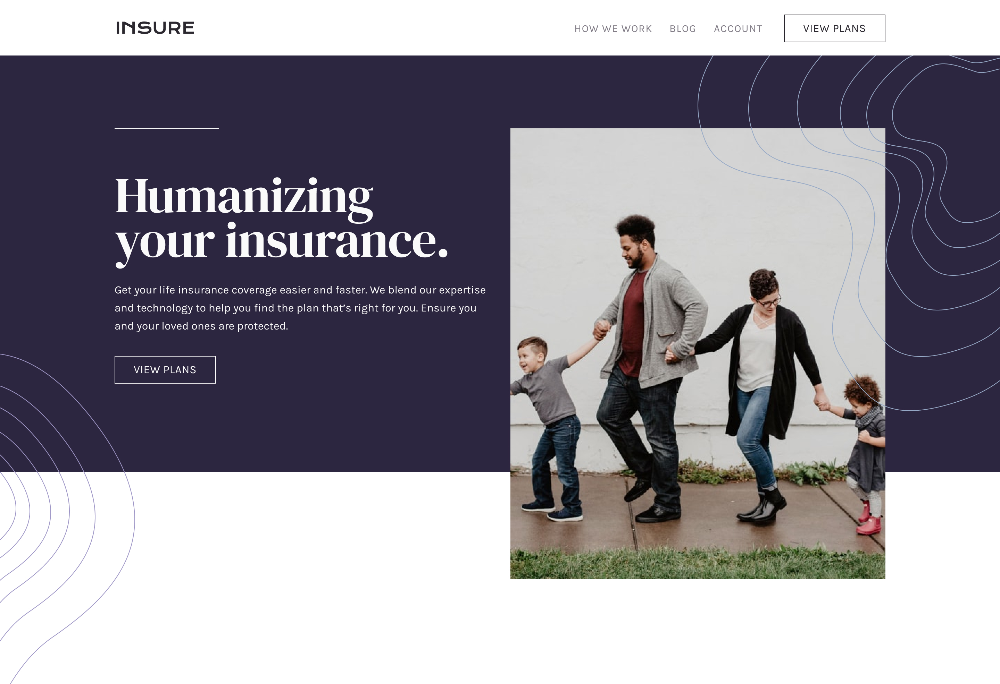
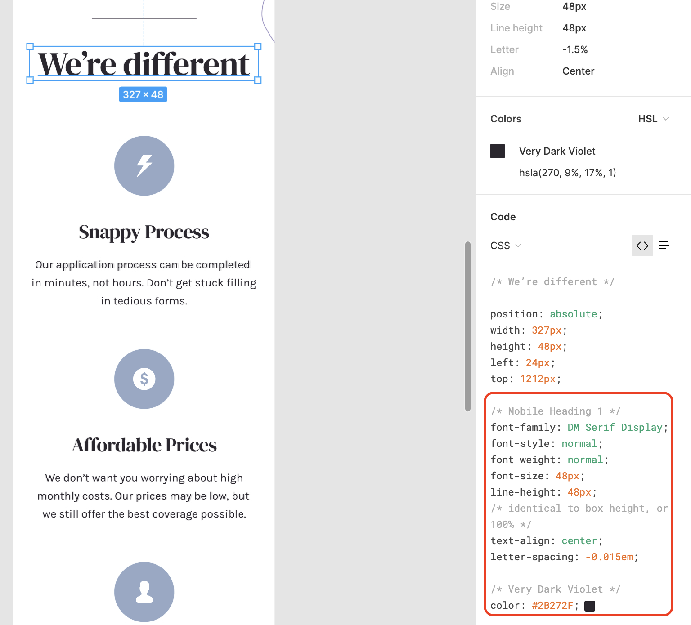
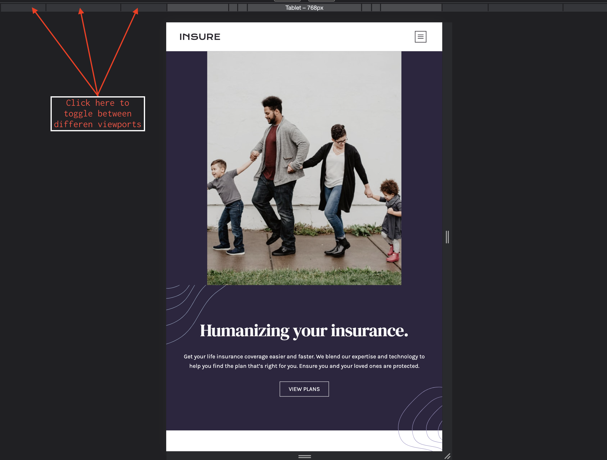

# Frontend Mentor - Insure landing page solution

This is a solution to the [Insure landing page challenge on Frontend Mentor](https://www.frontendmentor.io/challenges/insure-landing-page-uTU68JV8). Frontend Mentor challenges help you improve your coding skills by building realistic projects.

## Table of contents

- [Overview](#overview)
  - [The challenge](#the-challenge)
  - [Screenshot](#screenshot)
  - [Links](#links)
- [My process](#my-process)
  - [Built with](#built-with)
  - [What I learned](#what-i-learned)
  - [Useful resources](#useful-resources)
- [Author](#author)
- [Acknowledgments](#acknowledgments)

## Overview

### The challenge

Users should be able to:

- View the optimal layout for the site depending on their device's screen size
- See hover states for all interactive elements on the page

### Screenshot



### Links

- [Solution URL](https://www.frontendmentor.io/solutions/frontend-mentor-insure-landing-page-solution-zvW_yE8W0)
- [Live Site URL](https://condescending-poitras-21b478.netlify.app/)

## My process

### Built with

- Semantic HTML5 markup
- CSS custom properties
- Flexbox
- CSS Grid
- Mobile-first workflow
- [Astro](https://docs.astro.build/en/getting-started/) - static site builder

### What I learned

- default value for property display is inline 🙈

```css
.selector {
  display: inline;
}
```

<br>
- use figma inspect tool to check css typo or other properties



<br>

- Using the devtool to toggle between viewports
  

<br>

- using css to change color of svgs (see [Footer.astro](https://github.com/MinhKhangTran/w52s_8_astro_insure/blob/main/src/components/Footer.astro))

```scss
a {
  cursor: pointer;
  transition: all 0.35s ease-in;
  &:hover > svg > path {
    fill: var(--very-dark-violet);
  }
}
```

## Author

- [52 Weeks 52 Websites](https://www.minhkhangtran.com/)
- [Frontend Mentor Profile](https://www.frontendmentor.io/profile/MinhKhangTran)
- [Twitter](https://twitter.com/devLifting_)
- [Github](https://github.com/MinhKhangTran)
